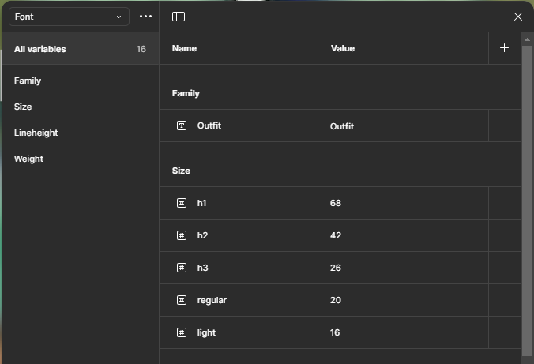
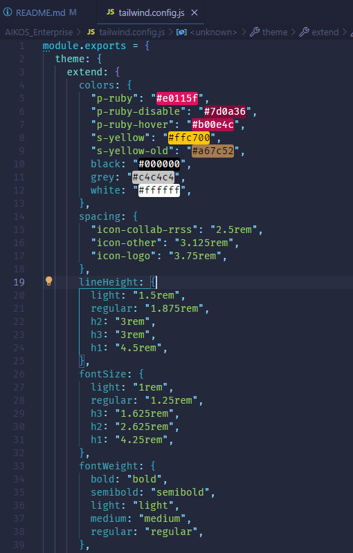

# P5.1 Sistema de diseño y componentes React con Tailwind
> Participantes: Marcos Alarcón Alguacil y Aitor González Barrera 
> Curso: S2DAW  
> Módulo: DIW 

## Descripción

En esta práctica, nuestro objetivo es transformar los wireframes diseñados en la práctica anterior en un sistema de diseño bien estructurado dentro de Figma. Posteriormente, exportaremos los estilos a un proyecto en React con TypeScript, utilizando Tailwind CSS para la estilización, asegurando una integración fluida y una apariencia consistente en la aplicación.

### Definir el Sistema de Diseño en Figma
#### Elección de las fuentes y tipografías
- Hemos elegido la fuente Outfit de Google Fonts, una tipografía sans-serif que destaca por su excelente legibilidad en distintos tamaños. Además, aporta un toque elegante y estético que armoniza perfectamente con el estilo y la paleta de colores de la página.
#### Elección de paleta de colores
- Inicialmente, los tonos de la página iban a ser rosa cerezo, pero finalmente nos decantamos por el rojo rubí, ya que aporta un toque más personal. Combinado con el dorado como color secundario, ambos tonos se integran de manera armoniosa, logrando una estética sofisticada y equilibrada.
#### Definir los componentes básicos
Hemos definido varios componentes en Figma para su implementación y traducción a React con TypeScript, asegurando coherencia y eficiencia en el desarrollo:
  - Navbar
  - Diferentes botones
  - Acordeón
  - Formulario
  - Cards

### Exportar el Sistema de Diseño a Tailwind CSS
- Primero hemos creado las diferentes variables en figma y luego gracias al plugin "variables2css" exportamos las variable en formato css, para luego añadirlo en nuestro tailwind.config.js.

   

## Enlace de interes

[Figma](https://www.figma.com/design/srUQoB3xW4sDIrtRejIMZ1/AIKO'S-ENTERPRISE-Compartido?node-id=0-1&t=cTlVJS7FUt53NKqT-1)
[PáginaDesplegada]()