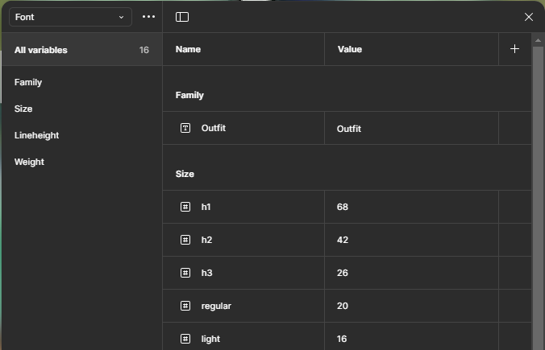

# P5.1 Sistema de Diseño y Componentes React con Tailwind

> **Participantes**: Marcos Alarcón Alguacil y Aitor González Barrera  
> **Curso**: S2DAW  
> **Módulo**: DIW

---

## Descripción

En esta práctica, nuestro objetivo es transformar los wireframes diseñados en la práctica anterior en un sistema de diseño bien estructurado dentro de Figma. Posteriormente, exportaremos los estilos a un proyecto en React con TypeScript, utilizando Tailwind CSS para la estilización, asegurando una integración fluida y una apariencia consistente en la aplicación.

### 1. Definir el Sistema de Diseño en Figma

#### Elección de las fuentes y tipografías

- **Fuente**: **Outfit** (Google Fonts). Elegida por su legibilidad y elegancia en distintos tamaños, aportando un toque moderno que armoniza perfectamente con el estilo de la página.

#### Elección de la paleta de colores

- Inicialmente, se consideraron tonos de rosa cerezo, pero finalmente optamos por el **rojo rubí** como color principal, combinándolo con el **dorado** como color secundario. Juntos crean una estética sofisticada y equilibrada.

#### Definición de los componentes básicos

En Figma, hemos diseñado varios componentes esenciales para la implementación en React con TypeScript, garantizando coherencia y eficiencia en el desarrollo:

- **Navbar**
- **Botones** (de diferentes estilos)
- **Acordeón**
- **Formulario**
- **Cards**

---

### 2. Exportar el Sistema de Diseño a Tailwind CSS

- Primero, creamos las variables en Figma y, con el plugin "variables2css", exportamos las variables en formato CSS.
- Luego, las incorporamos en el archivo `tailwind.config.js` para integrarlas correctamente en la configuración de **Tailwind CSS**.

 

- Para instalar la tipografía **Outfit**:
  1. Ejecutamos el comando `npm install @fontsource/outfit`.
  2. La importamos en `home.tsx` con `import "@fontsource/outfit";`, asegurando que la tipografía se cargue correctamente.

---

### 3. Implementar los Componentes en React con TypeScript

---

## Enlaces de interés

- [Figma - Sistema de Diseño](https://www.figma.com/design/srUQoB3xW4sDIrtRejIMZ1/AIKO'S-ENTERPRISE-Compartido?node-id=0-1&t=cTlVJS7FUt53NKqT-1)
- [Página Desplegada]() 
